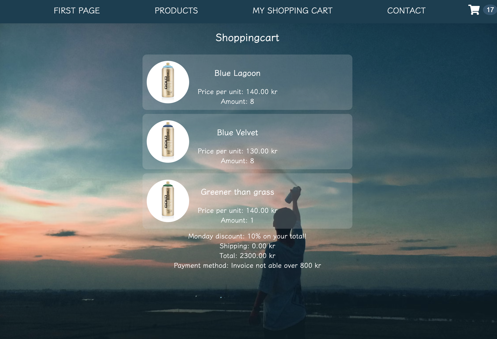

### Indvidual assignment - by Marcus Yttermyr

# Online Shop Assignment
Demo:
http://marcusey.github.io/FED23D-Munkshop/

## Requirements

1. **Single Page Order System**: The order page should be one single page. No switching between cart and product overview is allowed. One HTML file and associated JavaScript code are sufficient.

2. **Responsive Design**: The webshop should be responsive. The design/appearance is up to you, but it should work on mobile, tablet, and desktop.

3. **Intuitive Interface**: The interface/appearance of the page should be intuitive.

4. **Keyboard Accessibility**: It should be possible to complete the entire order process using only the keyboard (accessible).

5. **Product Quantity Control**: Next to/adjacent to each product, there should be buttons to increase and decrease the number of ordered products. These should also work with the keyboard.

6. **Hardcoded Products**: The products are hardcoded in the file (they do not need to come from an API, database, or JSON file).

7. **Order Confirmation**: When the order button is pressed, a confirmation box should appear with information about the order and delivery time.

8. **Product Sorting**: Products should be sortable by name, price, category, and rating.

9. **Real-Time Total Update**: The total sum should update based on changes in the number of ordered products in real-time.

10. **Cart Summary**: There should be a cart summary showing only the ordered products. This should be separate from the order form.

11. **Product Properties**: Each product should have the following properties:
    - A name
    - A price
    - A rating
    - A category
    - There should be at least 10 products in the webshop.

12. **Monday Discount**: On Mondays before 10 AM, a 10% discount is given on the total order amount. This is shown in the cart summary as a line with the text "Monday discount: 10% on the entire order."

13. **Weekend Surcharge**: On Fridays after 3 PM and until the night between Sunday and Monday at 3 AM, a weekend surcharge of 15% is added to all products. This should not be apparent to the customer, the price should just be higher in the "printout" of the products.

14. **Order Limit for Invoice Payment**: If the customer has ordered for a total of more than 800 SEK, it should not be possible to choose an invoice as a payment method.

15. **Bulk Order Discount**: If the customer has ordered at least 10 products of the same type, the price for that type of product should be discounted by 10%.

16. **Free Shipping**: If the customer orders a total of more than 15 products, the shipping is free. Otherwise, the shipping cost is 25 SEK plus 10% of the total amount in the cart.

17. **Order Timeout**: If the customer has not placed the order within 15 minutes, the order form should be cleared, and the customer should be notified that they were too slow.

18. **Order Form Fields**: The form where the buyer fills in their details should have:
    - Fields for:
        - First name
        - Last name
        - Address (street)
        - Postal code
        - City
        - Any entry code
        - Phone (mobile)
        - Email address
    - Choice of payment method: card or invoice
    - If the invoice is chosen as the payment method, a form field for the Swedish personal number should appear. This field should also be validated before the form can be submitted, i.e., a correct personal number must be filled in.
    - If a card is chosen as the payment method, fields for card number, date/year, and CVC should appear. These do not need to be validated!
    - Checkbox for consent to the processing of personal data
    - Checkbox for newsletter subscription (should be checked by default)

19. **Form Validation**: All form fields should be validated and the form/order should not be able to be submitted if there are any errors.

20. **Error Indication**: Errors should be marked and communicated clearly (e.g., not only with red color, consider accessibility).

21. **Submit Button Activation**: When the form is correctly filled out, the Submit/Order button should be activated; before that, it should be grayed out.

22. **Clear Order Button**: There should be a "Clear order" button that resets all form fields as well as any ordered products (i.e., the number is reset to 0).

23. **Discount Code Field**: There should be a field to enter a discount code.

24. **Visual Feedback on Total Update**: There should be some form of visual feedback when the cart's total amount is updated. This means, for example, some visual change, such as a color shift, size change, or equivalent.

25. **CSS with Sass or Tailwind**: The CSS should be built using Sass (or Tailwind).

26. **Vanilla JavaScript Only**: You should only use "Vanilla JavaScript", i.e., you are not allowed to do this using a framework.

27. **HTML Structure**: HTML can be written in the HTML document; nodes do not need to be created with JavaScript unless absolutely necessary.


### How to Deploy
To deploy this project run in terminal:

```bash
  npm i
  npm run dev
```

#### Languages used:


#### Framework:


### Screenshots:

#### Desktop: 


#### Mobile:


#### Products in cart:



### Validation:
#### Lighthouse:


#### CSS:


#### HTML:


#### Authors
- [@Marcusey](https://www.github.com/marcusey)

